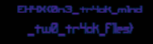

# Let-The-Penguin-Live Forensic

**Category:** Forensics / Audio Steganography
**Points:** 50
**Author:** mahekfr

## Overview
This challenge provides a multimedia container file named `challenge.mkv`. The challenge falls under the Forensics and Audio Steganography category, where participants are required to extract hidden audio tracks, apply audio processing techniques to isolate a signal, and analyze the sound spectrum to extract hidden information.

## Problem Abstraction
The main objective is to identify that the MKV file contains multiple audio tracks. Based on the hint "Silence the crowd to hear the individual," participants must extract these tracks, use phase inversion (phase cancellation) to remove the background noise, and analyze the resulting isolated audio using a spectrogram to reveal a hidden visual flag.

## Vulnerability Analysis
The challenge relies on a classic audio steganography and forensics technique. The MKV container hides multiple audio streams. The hint strongly points toward a **Phase Cancellation** attack. One track acts as the background noise ("the crowd"), while another track contains that exact same background noise mixed with a hidden signal ("the individual"). When two identical audio waves are mixed but one is inverted (180 degrees out of phase), they cancel each other out completely. Doing this leaves only the hidden anomaly behind. Furthermore, the hidden anomaly is not an audible voice, but visual data painted into the audio's frequency spectrum.

## Attack Strategy
1. Inspect the metadata of the `.mkv` file to identify the number of embedded audio tracks.
2. Extract the target audio tracks from the video container using `ffmpeg` or `mkvextract`.
3. Import the extracted audio tracks into an audio editing software like **Audacity**.
4. Apply the **Invert** effect to the background ("crowd") track to trigger phase cancellation when played alongside the mixed track.
5. Change the track view mode from Waveform to **Spectrogram** to visually inspect the remaining frequencies and read the flag.

## Implementation

### 1. Extraction
First, `ffmpeg` is used to map and extract the hidden audio streams from the MKV container into separate files.

```bash
ffmpeg -i challenge.mkv -map 0:a:0 audio1.wav
ffmpeg -i challenge.mkv -map 0:a:1 audio2.wav

```

### 2. Phase Inversion

* Both `audio1` and `audio2` are imported into Audacity.
* The track containing just the background noise is selected, and the `Effect > Invert` tool is applied.
* Mixing these two tracks mathematically subtracts the background noise, "silencing the crowd."

### 3. Spectrogram Analysis

The resulting isolated audio track is analyzed by clicking the track name dropdown in Audacity and selecting **Spectrogram**.

## Result

The phase cancellation successfully isolates the hidden signal. Looking at the Spectrogram view, the frequencies visually form a clear, readable text in the higher frequency ranges.




**Flag:** `EH4X{0n3_tr4ck_m1nd_tw0_tr4ck_f1l3s}`

## Lessons Learned

* Familiarization with multimedia container formats (MKV) and stream extraction tools like `ffmpeg` and `exiftool`.
* Understanding the physics of sound, specifically how **Phase Inversion** can be used as a forensic technique to isolate hidden audio signals.
* The importance of spectral analysis (Spectrograms) in identifying visual steganography hidden within audio files.

```
